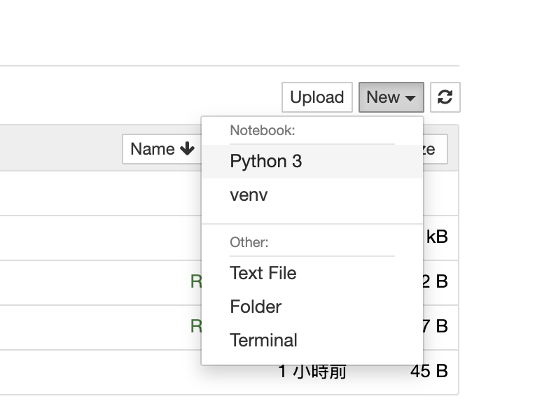

之前一直在pycharm配置好的virtual enviroment下码代码，隔离外部环境。
某一天，突然在虚拟环境下打开了jupyter notebook，想当然的以为notebook用的应该也是pycharm配置好的虚拟环境，
很显然结果并不是。。。

pip install ipykernel
python -m ipykernel install --user --name venv --display-name venv
上述命令把通过原先创建好的名为venv的虚拟环境注册到notebook当中，并且其显示名也为venv

这样就可以在启动jupyter是，选择venv这个环境啦～

